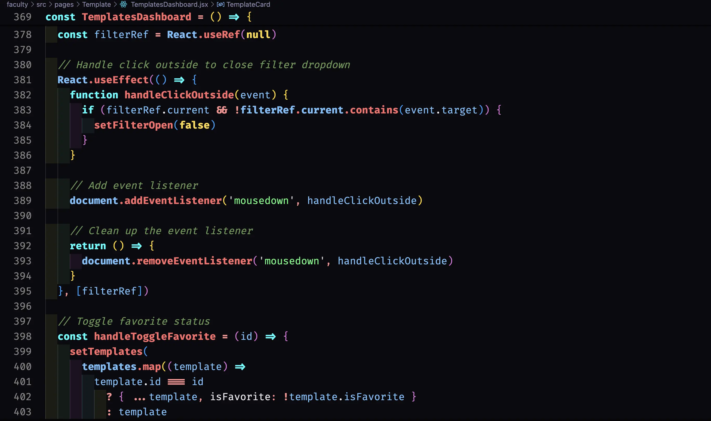
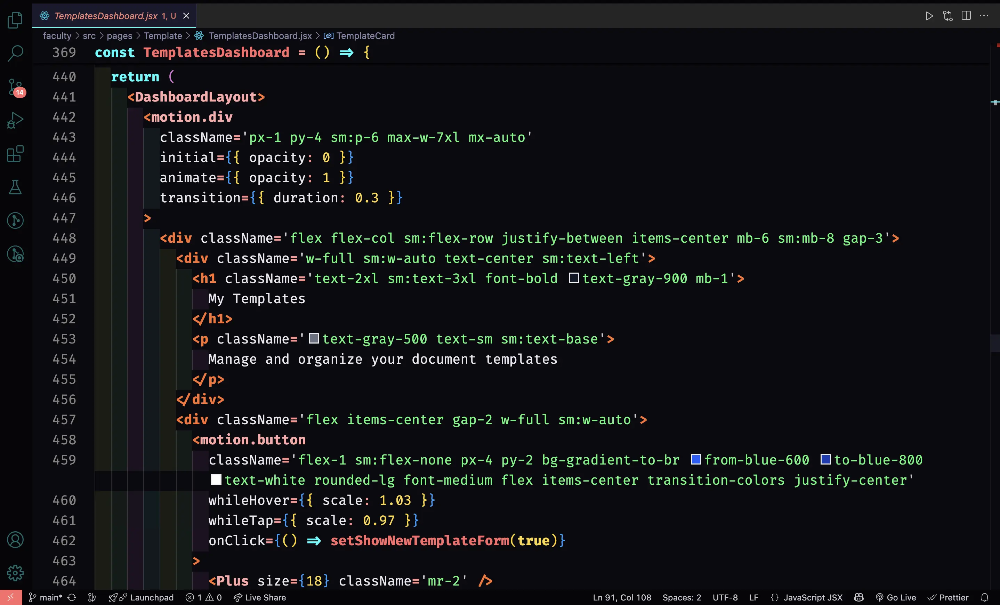
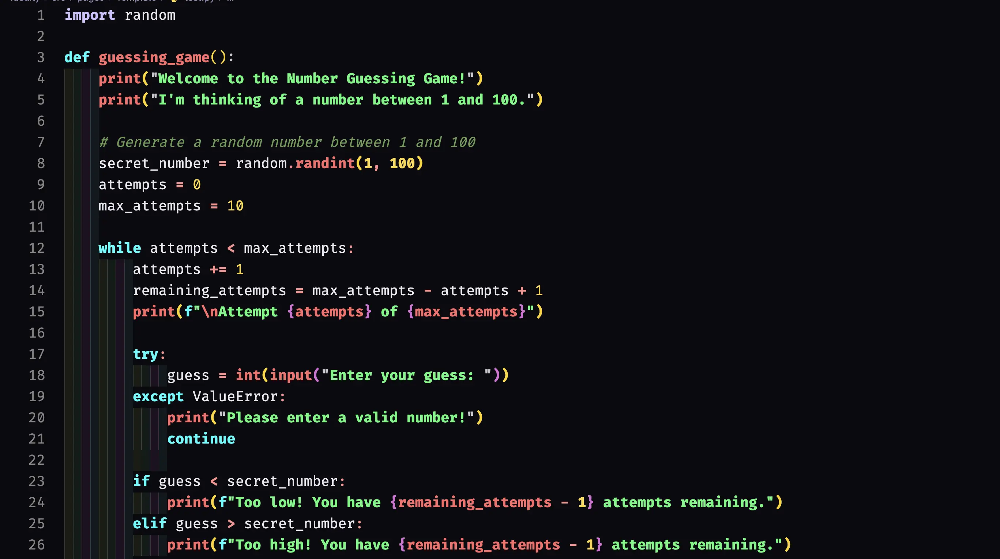
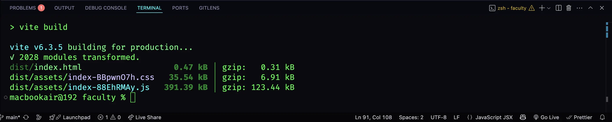

# Dark Aura Theme

A super dark VS Code theme with bright, vibrant colors designed for developers who love working in the darkest environments with eye-catching syntax highlighting.

## ✨ Features

### 🌙 **Ultra Dark Experience**

- Deep dark background (#0a0a0f) perfect for late-night coding
- Reduces eye strain during long coding sessions
- Minimal light emission for comfortable viewing

### 🎨 **Vibrant Syntax Highlighting**

- **Keywords**: Bright cyan (`#00ffff`) for maximum visibility
- **Strings**: Vibrant green (`#51fa7b`) for easy identification
- **Functions**: Coral red (`#ff6b6b`) that stands out
- **Variables**: Light blue (`#74c0fc`) for clear distinction
- **Numbers & Constants**: Golden yellow (`#ffd93d`)
- **HTML/JSX Tags**: Bright orange (`#ff6f2c`)

### 🚀 **Language Support**

- **JavaScript & TypeScript** - Full ES6+ support
- **React (JSX/TSX)** - Component highlighting
- **HTML & CSS** - Complete web development support
- **JSON** - Clean object notation
- **Python, PHP, Java** - Multi-language compatibility

### 💻 **Complete UI Theming**

- **Terminal**: Bright green text on dark background
- **Sidebar**: Organized with cyan accents
- **Status Bar**: Clean, minimal design
- **Tabs**: Clear active/inactive distinction
- **Scrollbars**: Subtle, non-intrusive design

## 🎯 Perfect For

- **Full-stack developers** working with MERN stack
- **Frontend developers** using React/Vue/Angular
- **Backend developers** working with Node.js/Python
- **Anyone who prefers ultra-dark themes**
- **Night owl programmers** 🦉

## 🎨 Color Palette

- **Background**: Deep dark blues and blacks (`#0a0a0f`)
- **Keywords**: Bright cyan (`#00ffff`)
- **Strings**: Vibrant green (`#51fa7b`)
- **Functions**: Coral red (`#ff6b6b`)
- **Variables**: Light blue (`#74c0fc`)
- **Numbers**: Golden yellow (`#ffd93d`)
- **HTML Tags**: Orange (`#ff6f2c`)

## 📸 Screenshots

### JavaScript/React Code

### TypeScript/Advanced Features

### Python Development

### Terminal & Complete UI

## 📦 Installation

1. Open VS Code
2. Go to Extensions (`Ctrl+Shift+X` or `Cmd+Shift+X`)
3. Search for **"Dark Aura"**
4. Click **Install**
5. Go to `Settings > Color Theme` and select **"Dark Aura"**

## 🛠️ Supported Languages

- JavaScript & TypeScript
- React (JSX/TSX)
- HTML & CSS/SCSS
- JSON & YAML
- Python
- PHP & Java
- C/C++ & C#
- Go & Rust
- And many more!

## 🤝 Connect with Me

- 🎥 **YouTube**: [FurqanDev](https://www.youtube.com/@furqandev) - Coding tutorials and tech content
- 💼 **Portfolio**: [furqan.cc](https://furqan.cc/) - Check out my projects
- 📸 **Instagram**: [@furqancodes](https://www.instagram.com/furqancodes/) - Daily coding snippets

## 💬 Feedback & Support

If you have any suggestions, issues, or feature requests:

- 🐛 [Open an issue](https://github.com/furqanistic/darkaura/issues) on GitHub
- ⭐ Star the repository if you like the theme
- 📝 Leave a review on the VS Code marketplace

## 📄 License

This theme is released under the [MIT License](LICENSE).

---

**Enjoy coding in the dark! 🌙✨**

_Made with ❤️ by [Furqan](https://furqan.cc/)_
